# Práctica Formativa Obligatoria 2 - Prompt Engineering en Agentes de IA

## Datos del Estudiante

* **Nombre:** Rodrigo
* **Apellido:** Zocco
* **Materia:** Desarrollo de Sistemas Web (Front End)
* **Comisión:** 2º E

---

## Link al deploy unificado

Acceso al proyecto desplegado:

- [Visitar deploy](https://front-zocco-2e-pfo2.vercel.app/)
- **URL:** https://front-zocco-2e-pfo2.vercel.app/

Este enlace dirige a la página principal del proyecto, desde donde es posible acceder a las tres opciones solicitadas.

---

## Prompt Utilizado

El prompt exacto utilizado para la generación de los sitios web es:

```text
Eres un diseñador UI/UX y desarrollador frontend senior especializado en landing pages de alta conversión.

<tarea>
Genera una landing page profesional completa en un único archivo HTML, con CSS interno y sin dependencias externas excepto Google Fonts.
</tarea>

<requisitos_obligatorios>
1. Header fijo con logo y menú de navegación con scroll suave a cada sección
2. Hero Section con: titular impactante, subtítulo, botón CTA principal y métricas de prueba social
3. Sección "Sobre Nosotros" con descripción de la empresa y visualización de logros
4. Sección de Servicios con 6 cards que describan características clave
5. Sección de Testimonios con 3 reseñas reales con nombre, rol y empresa
6. Formulario de contacto visual (sin backend) con campos: nombre, email, empresa, mensaje y selector de servicio
7. Footer con logo, descripción, enlaces a redes sociales (LinkedIn, Twitter, Instagram, YouTube) y secciones de links
</requisitos_obligatorios>

<criterios_de_calidad>
- Paleta coherente de 3-4 colores con contraste accesible (WCAG AA mínimo)
- Tipografía: una fuente display para títulos y una sans-serif para cuerpo
- Layout responsive: funcional en móvil (320px) y escritorio (1440px)
- Variables CSS para mantener consistencia de tokens
- Transiciones suaves en hover para elementos interactivos
- Separadores visuales entre secciones
</criterios_de_calidad>

<estilo>
Tema oscuro (dark mode nativo). Paleta: fondo casi negro, acento en violeta/púrpura, texto primario claro. Estética: tech, moderna, sin ornamentos innecesarios. El diseño debe transmitir confianza y profesionalismo.
</estilo>

<formato_de_salida>
Primero: explica brevemente la paleta elegida y la justificación del diseño (3-5 líneas).
Luego: genera el código React completo listo para abrir en el navegador, sin truncar ninguna sección.
</formato_de_salida>
```

---

## Capturas de Pantalla

### Landing Page 1 (Claude)

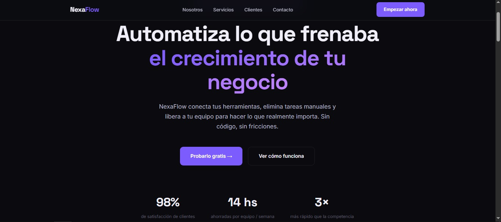
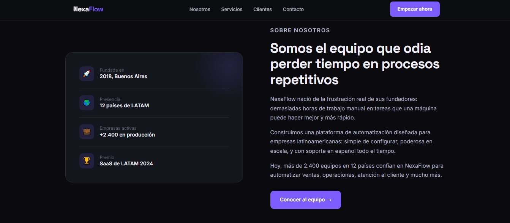
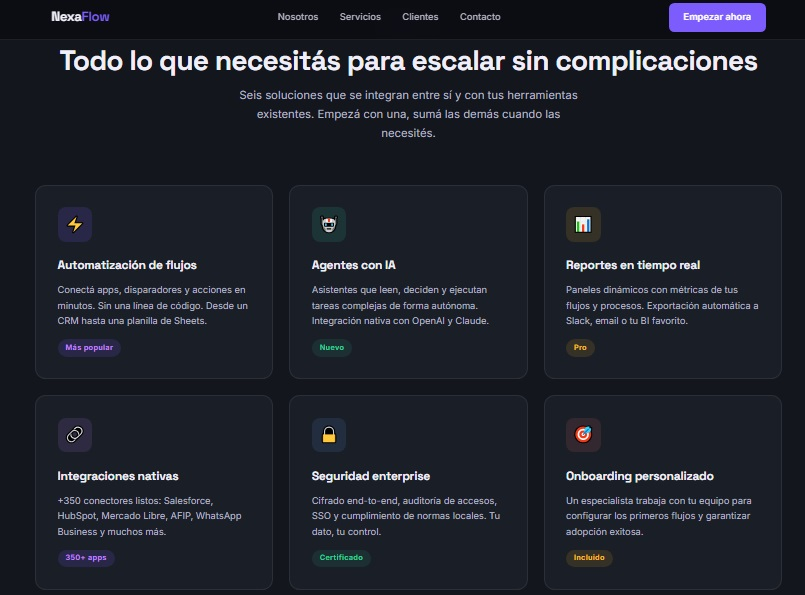
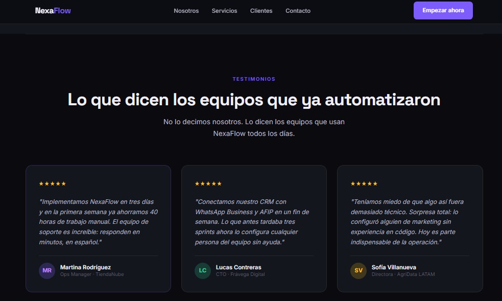
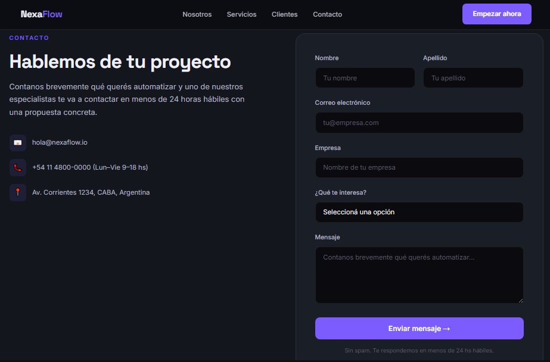
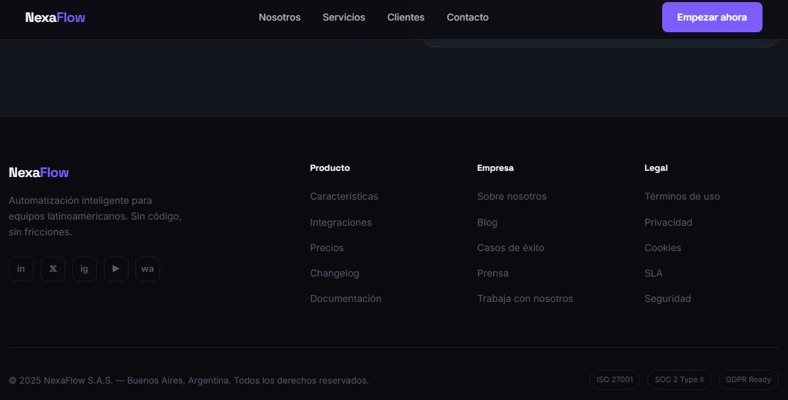

---

### Landing Page 2 (OpenAI)

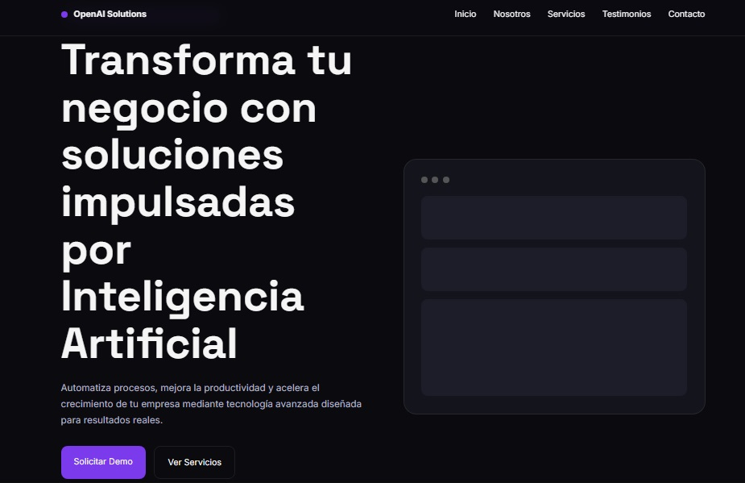
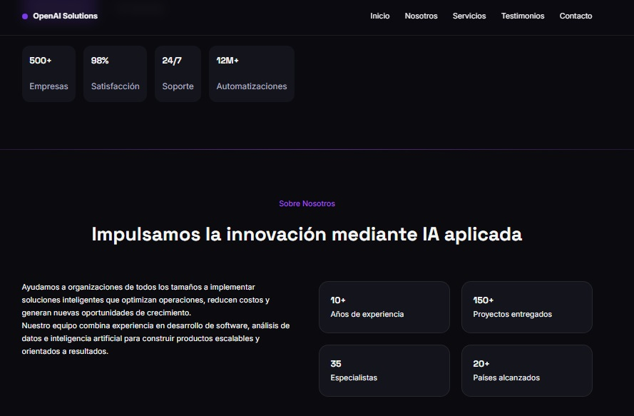
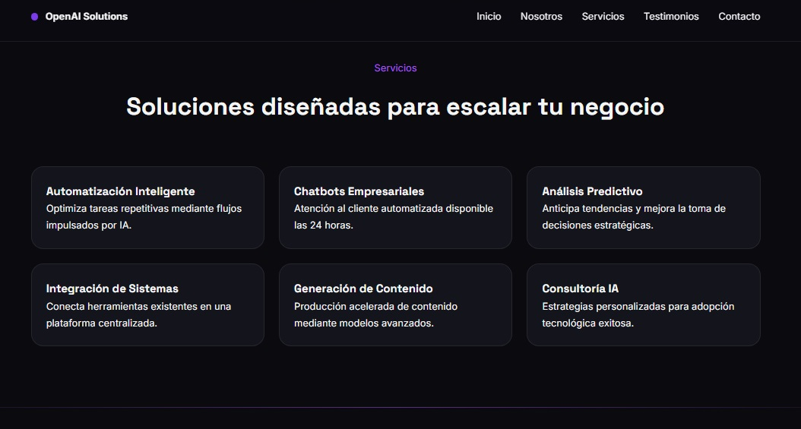
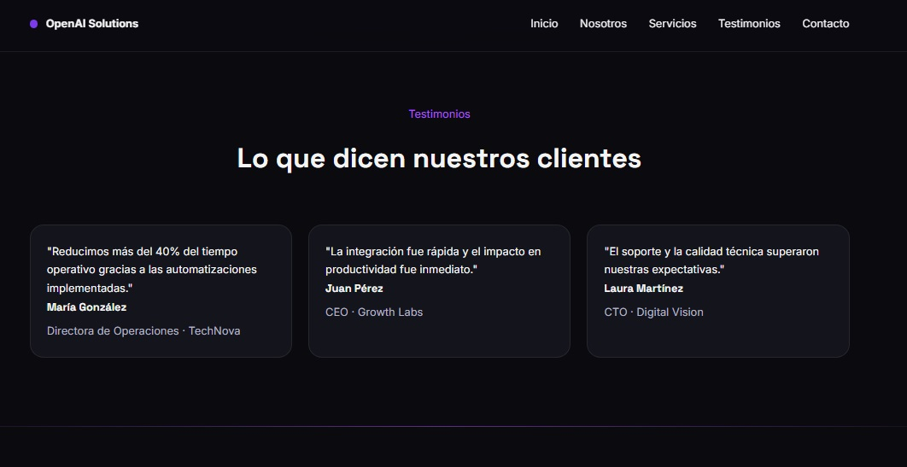
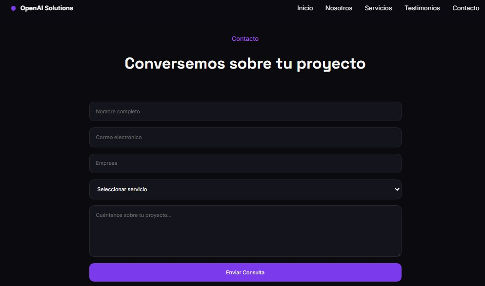
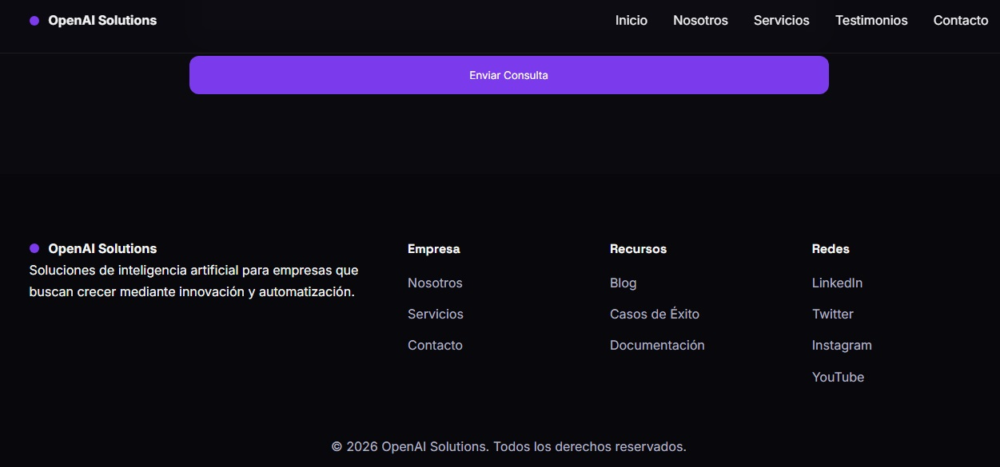
